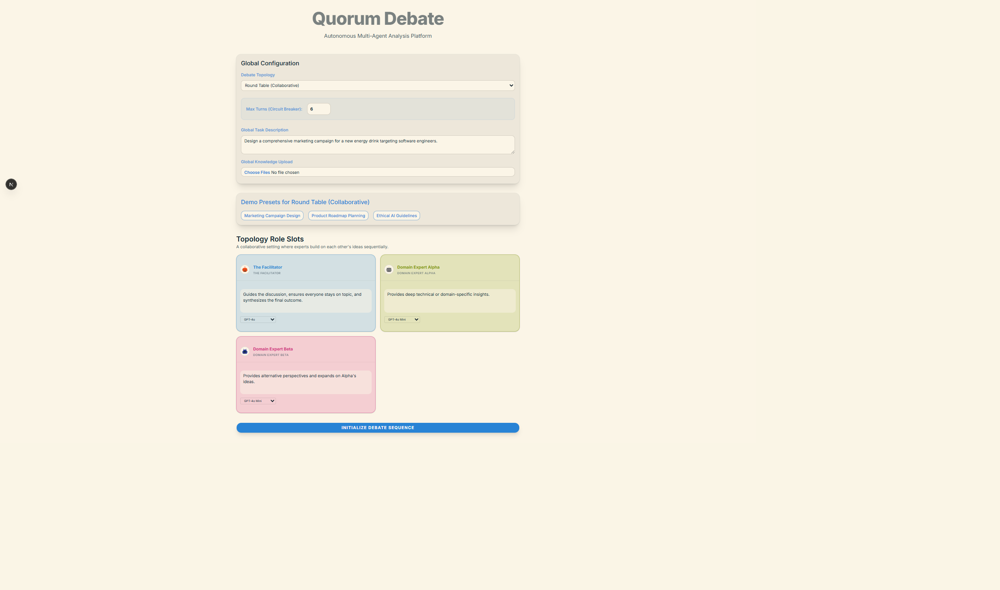
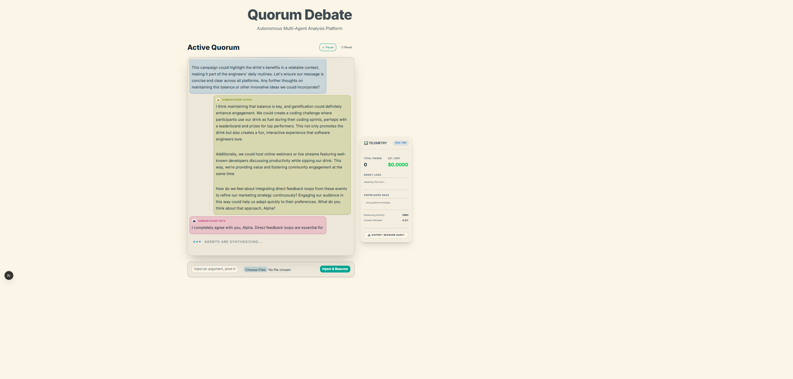

# Quorum Debate Protocol

## Project Vision

Quorum Debate explores the concept of multi-agent collaboration. Rather than relying on a single language model to evaluate a complex document or strategy, this project orchestrates a "jury" of distinct AI personas. By assigning specific expertise, biases, and goals to different agents, the system simulates a structured debate. The agents collaborate, critique each other's reasoning, and ultimately synthesize a consensus that is more robust than any single model's isolated output.

The current codebase serves as a simple, foundational implementation of this broader idea.


*Figure 1: The initial configuration interface where users define the global objective, select the routing topology, and upload documentation for the debate.*

## Collaborative Mechanisms

### The Debate Topology
In a multi-agent system, the order in which agents speak (the topology) fundamentally changes the outcome. This implementation uses a sequential round-robin approach. Agent A speaks, Agent B reviews Agent A's point and adds its own perspective, and so on. This allows for cumulative reasoning, where each subsequent agent builds upon or tears down the prior arguments.

### Asymmetric Knowledge Distribution
To simulate real-world collaboration, agents don't always need to share the exact same context. The system allows for:
- **Global Knowledge:** Foundational documents provided to all agents to establish a shared ground truth.
- **Agent-Specific Knowledge:** Private documents given only to specific personas (e.g., providing a Financial Expert with raw budgetary data while keeping the general Facilitator focused only on high-level strategy). This forces the agents to communicate their unique findings to the group.

### Human-in-the-Loop Steering
Multi-agent systems can sometimes veer off course or reach premature conclusions. Quorum Debate includes asynchronous steering, allowing a human evaluator to interject mid-debate. When the human speaks, the agents are forced to pause, absorb the new feedback, and re-evaluate their positions before moving toward a final consensus.


*Figure 2: The mid-run execution state. The system cycles through the configured agents, routing messages and executing the collaborative debate.*

## Step 0: Environment Configuration

Before executing the local server, the environment must be configured. 

Duplicate the `.env.example` file and rename it to `.env`. Populate all keys with valid credentials. The `.env.example` file contains specific requirements for the OpenRouter and OpenAI credentials. The application requires these keys to instantiate the execution endpoints.

## Installation and Execution

1. Install package dependencies:
```bash
npm install
```

2. Execute the local development server:
```bash
npm run dev
```

3. Access the interface at `http://localhost:3000`.
